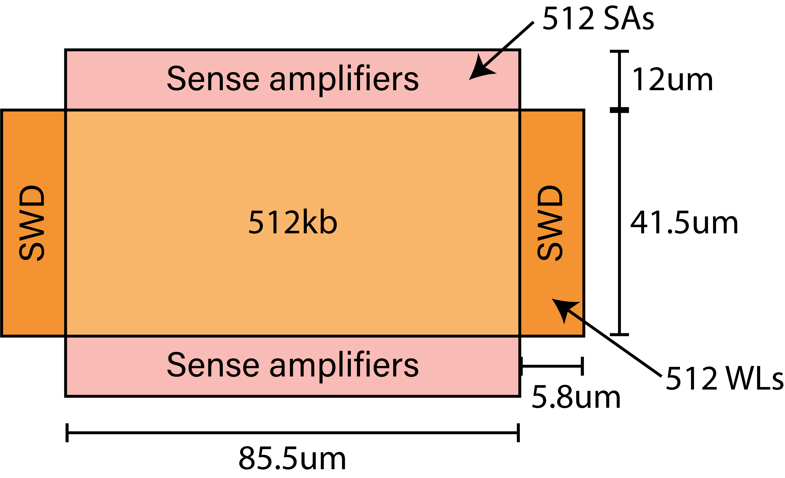

# REM - REGA DRAM Model

This repository provides the DRAM model used in the paper _[REGA: Scalable Rowhammer Mitigation with
Refresh-Generating Activations](https://comsec.ethz.ch/wp-content/files/rega\_sp23.pdf)_ that is to appear in the IEEE conference Security & Privacy (S&P) 2023.

## Requirements

To simulate REM you will need [LTSpice](https://www.analog.com/en/design-center/design-tools-and-calculators/ltspice-simulator.html) and the transistor model from [PTM](https://ptm.asu.edu/) (filename: _transistor_model.pm_).

## Topology
REM includes models to simulate:
- Sense amplifiers with the capability of overdriving
- Sub-word line drivers
- Write drivers
- Precharge circuit
- Column select transistors

Transmission-line models of:
- Local-IOs
- Main-IOs
- Sub-word lines 
- Bitlines

The voltage levels used in the model are:
- VPP = 2.5V
- VSS = 0V (Array low)
- VPERI = 1.1V (Write voltage)
- VARY = 1.0V (Array high). This is the value at which cells are recharged, and referred to as VDD in the paper for simplicity.
- VEQ = 1.5V (EQ control voltage)
- VOD = 1.4V (Overdrive)

In the following figure we report the layout of a single MAT with its dimensions:


The file is included in the repository. The lengths are used in the model to compute the various parasitic loads.

## Using the LTSpice model
The file REM.asc already contains timing for a basic row activation. This can be used to perform accurate simulations of the DRAM behavior, or to extend DRAM functionalities.
## Citing our Work

To cite the REGA, please use the following BibTeX entry:

```
@inproceedings{marazzi2023rega,
  title={REGA: Scalable Rowhammer Mitigation with Refresh-Generating Activations},
  author={Marazzi, Michele and Solt, Flavien and Jattke, Patrick and Takashi, Kubo and Razavi, Kaveh},
  booktitle={2023 IEEE Symposium on Security and Privacy (SP)},
  pages={},
  year={2023},
  organization={IEEE}
}
```

## License
All the REM related contributions are licensed under the GNU General Public License version 3.